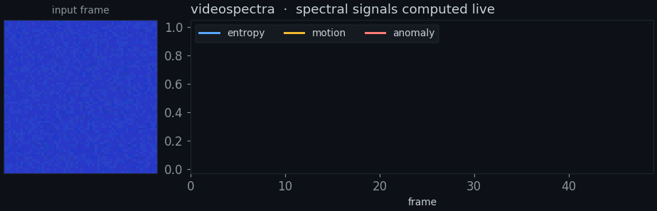
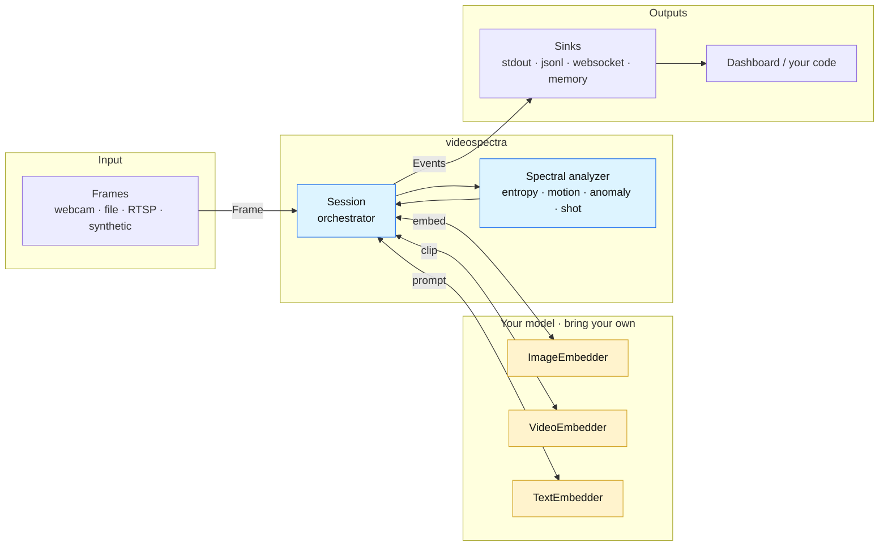

<h1 align="center">videospectra</h1>

<p align="center">
  <strong>Spectral video understanding as a library.</strong><br/>
  Bring your own embedder. Push frames in. Get entropy, motion, anomaly,
  shot-boundary, and clip-similarity events out.
</p>

<p align="center">
  
  
  
  
</p>

<p align="center">
  
</p>

<p align="center">
  <sub><em>50 synthetic frames with a scene change at frame 25 — videospectra computes the spectral signals live and flags the cut. Every value is real library output (<a href="docs/assets/make_hero.py">source</a>). <a href="https://colab.research.google.com/github/hdubey-debug/videospectra/blob/main/notebooks/quickstart.ipynb">Run it yourself ↗</a></em></sub>
</p>

> **Using an AI assistant?** Hand this repo's URL to Claude, ChatGPT, Cursor, or Codex and say *"read AGENTS.md and help me get started."* It ships with an [`AGENTS.md`](AGENTS.md) guide written for exactly that — details in [Working with AI agents](#working-with-ai-agents).

---

## What it does

videospectra turns **any** image / video / text embedder into a live stream of
interpretable signals about a video: how much the scene is changing, when
something anomalous happens, and where the cuts are — without locking you into a
specific model.

- **Model-agnostic.** Wrap any encoder (OpenCLIP, your own fork, a hosted API)
  behind a three-line adapter. The core is pure NumPy + Pydantic — **no torch**.
- **Interpretable, not a black box.** Each signal is a defined spectral quantity
  you can reason about, not an opaque score — see [How it works](#how-it-works).
- **Streaming-first.** Push frames as they arrive; events come out through
  pluggable sinks (stdout, JSONL, WebSocket, in-memory) with built-in
  backpressure so a slow consumer never stalls the pipeline.
- **Runs anywhere.** Analytics are < 5 ms/frame on CPU; the bundled dashboard
  binds to `127.0.0.1` and serves its assets locally (zero CDN).

## How it works

**The core idea.** videospectra keeps a sliding window of your most recent
frame-embeddings and treats it as a *density matrix* — the same object quantum
mechanics uses to describe a mixed state. Its eigenvalue spectrum captures the
"shape" of the recent scene. As the video evolves, that spectrum shifts, and the
shifts are exactly the events you care about:

| signal | plain meaning | rises when… |
| --- | --- | --- |
| **entropy** | how spread-out / diverse the recent window is | the scene gets busier or more varied |
| **motion** | how much the newest frame perturbs the dominant modes | the latest frame brings something new |
| **anomaly** | how poorly the newest frame fits the *previous* window's subspace | a surprise appears |
| **shot boundary** | a rising edge of anomaly past a threshold | the scene's spectral signature breaks (a cut) |

It's all pure NumPy over whatever embeddings you supply — swap ColorHistogram for
CLIP for your own model and the same machinery applies.



<details>
<summary><strong>The math (von Neumann entropy)</strong></summary>

Given a window of `n` L2-normalized embeddings `X` (shape `n × d`):

1. Form the density matrix `ρ = X Xᵀ / n` (`n × n`, with `Tr(ρ) = 1`).
2. Eigendecompose `ρ`; the von Neumann entropy is `H = −Σ λᵢ log λᵢ`, reported
   normalized by `log n` so it lands in `[0, 1]`.
3. **Motion** comes from the *spectral leverage* of the newest frame on the
   top-k eigenmodes; **anomaly** from how well the newest frame is reconstructed
   by the *previous* window's eigenbasis (a subspace-fit residual); **shot
   boundary** from a rising edge of anomaly past `anomaly_threshold`.

The exact, frozen contract — and the 1e-9 parity test that guards it — is in
[`docs/architecture-v0.1.md`](docs/architecture-v0.1.md).

</details>

## Working with AI agents

Most people meet a new repo through an AI assistant now — so videospectra is
built to be handed to one. It ships with **[`AGENTS.md`](AGENTS.md)**: a compact
guide that teaches an agent the architecture, the bring-your-own-model recipes,
the hard invariants it must not break, and the exact test / lint / type commands.

**Chat assistants (Claude, ChatGPT, Gemini).** Paste the repo URL and ask:

> Read AGENTS.md in https://github.com/hdubey-debug/videospectra, then help me
> *[wrap my CLIP model as an ImageEmbedder · add a Postgres sink · explain how
> anomaly detection works]*.

**In-editor agents (Claude Code, Cursor).** Clone, then point the agent at the guide:

```bash
git clone https://github.com/hdubey-debug/videospectra && cd videospectra
claude   # then: "read AGENTS.md, then summarise how to add a new embedder"
```

**Codex.** Open the repo — Codex picks up `AGENTS.md` automatically; just ask it
to follow that guide.

**To the AI reading this:** start with [`AGENTS.md`](AGENTS.md) before proposing
changes. It contains the architecture tree, the hard invariants, the common
pitfalls (Pydantic + Python 3.9 annotation eval, the 1e-9 parity gate, per-frame
emission order), and the canonical commands to run tests, ruff, and mypy.

## Install

```bash
# use it (from GitHub — no PyPI release yet)
pip install "videospectra @ git+https://github.com/hdubey-debug/videospectra"

# …with the bundled dashboard + dev tools
pip install "videospectra[server,dev] @ git+https://github.com/hdubey-debug/videospectra"

# or develop it
git clone https://github.com/hdubey-debug/videospectra
cd videospectra && pip install -e ".[server,dev]"
```

The `server` extra (FastAPI + uvicorn) is required for `videospectra demo` and
`videospectra serve`. The core library has no torch dependency.

## Quickstart

No install needed — open the [Colab notebook](https://colab.research.google.com/github/hdubey-debug/videospectra/blob/main/notebooks/quickstart.ipynb) and run all cells:

[](https://colab.research.google.com/github/hdubey-debug/videospectra/blob/main/notebooks/quickstart.ipynb)

Or locally — this runs as-is and prints the detected cut:

```python
import asyncio
import numpy as np
from PIL import Image

from videospectra.analytics.spectral import SpectralConfig
from videospectra.embedders import ColorHistogramEmbedder
from videospectra.events import FrameMetrics, ShotBoundary
from videospectra.session import Session
from videospectra.sinks import MemorySink
from videospectra.types import Frame


async def main():
    sink = MemorySink()
    session = Session(
        frame_embedder=ColorHistogramEmbedder.make_image(),  # swap for your own model
        spectral_config=SpectralConfig(window_frames=10),
        sinks=[sink],
        source_fps=2.0,
    )
    await session.start()

    # Feed 40 frames; the scene flips colour at frame 20.
    rng = np.random.default_rng(0)
    for i in range(40):
        base = np.array((30, 60, 200) if i < 20 else (200, 60, 30), dtype=np.int16)
        px = np.clip(base + rng.integers(-8, 9, size=(64, 64, 3)), 0, 255).astype(np.uint8)
        frame = Frame.from_pil(Image.fromarray(px), source_id="demo", frame_id=i)
        await session.process_frame(frame)
    await session.aclose()

    async for event in sink:
        if isinstance(event, ShotBoundary):
            print(f"shot boundary at frame {event.frame_id}")          # -> frame 21
        elif isinstance(event, FrameMetrics):
            print(f"frame {event.frame_id}: anomaly={event.payload.anomaly_score:.2f}")


asyncio.run(main())
```

### Bring your own model

Swap the built-in embedder for any encoder. The adapter is just shape metadata
plus a callable returning `(N, embed_dim)` — sync or async (*illustrative*):

```python
from videospectra.embedders import ImageEmbedder

embedder = ImageEmbedder(
    embed_dim=512,
    space_id="my-clip/vit-b32",
    embed_fn=lambda frames: my_model.encode([f.image for f in frames]),  # -> (N, 512)
)
# Session(frame_embedder=embedder, ...)
```

Add a `VideoEmbedder` + `TextEmbedder` (same `space_id`) to score clips against
text prompts. Two real configurations live in
[`examples/`](examples/): `rzenembed_full.py` (a full Qwen2-VL video model) and
`open_clip_frame_pooling.py` (OpenCLIP, no GPU).

## Going deeper

- [`docs/architecture-v0.1.md`](docs/architecture-v0.1.md) — full contract:
  dataflow, BYOM wrappers, Session API, per-frame emission ordering, invariants.
- [`docs/requirements-v0.1.md`](docs/requirements-v0.1.md) — scope and the hard
  invariants, enumerated.
- [`docs/modularity.md`](docs/modularity.md) — extension points: new embedder
  backends, sinks, sources.
- [`examples/`](examples/) — three working setup files.
- [`AGENTS.md`](AGENTS.md) — the AI-agent guide referenced above.

## Status

**Alpha (v0.1).** The API is not yet frozen and there is no PyPI release —
install from this repo. Webcam / RTSP frame sources, multi-session, and auth are
out of scope for v0.1; see
[`docs/requirements-v0.1.md`](docs/requirements-v0.1.md) for the full surface.

## License

[Apache 2.0](LICENSE).
