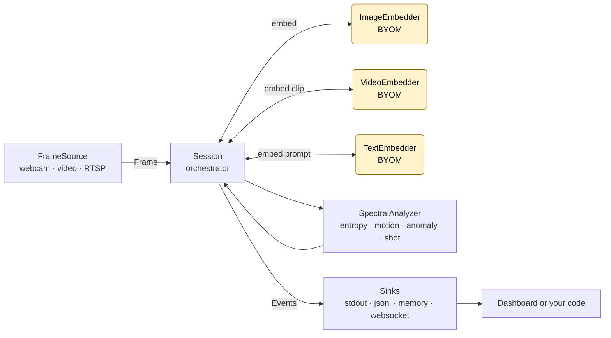

<h1 align="center">videospectra</h1>

<p align="center">
  Spectral video understanding as a library. Drop in your own image / video / text embedder, push frames in, get entropy / motion / anomaly / shot-boundary / clip-similarity events out.
</p>

<p align="center">
  
  
  
</p>



## Why use it

- **Bring your own model.** Wrap any image / video / text encoder behind three small `Embedder` adapters. No model is bundled; the core has no torch dependency.
- **Spectral signals out of the box.** Von Neumann entropy, motion, anomaly, and shot-boundary detection over a sliding window — pure NumPy, < 5 ms per frame on CPU.
- **One pipeline, many sinks.** Stream events to stdout, JSONL, WebSocket, an in-memory queue, or a bundled local dashboard — same `Session` object.
- **Source-agnostic.** Push `Frame` objects in from anywhere: webcam, file, RTSP, simulator, tests.

## Install

```bash
pip install -e .[server,dev]
```

`server` extras add FastAPI + uvicorn for the dashboard; `dev` extras add pytest / ruff / mypy. The core library has no torch dependency.

## Try it now

[](https://colab.research.google.com/github/hdubey-debug/videospectra/blob/main/notebooks/quickstart.ipynb)

The Colab quickstart runs the full pipeline on 50 synthetic frames with a scripted scene change — entropy, motion, anomaly traces plus shot-boundary markers — in under a minute, no GPU, no install.

Locally, after `pip install`:

```bash
videospectra demo
# open http://127.0.0.1:8765, allow webcam, watch entropy / motion / shot light up
```

## 60-second example

```python
import numpy as np
from videospectra.analytics.spectral import SpectralConfig
from videospectra.embedders import ImageEmbedder
from videospectra.session import Session
from videospectra.sinks import MemorySink

def embed_frames(frames):
    return np.stack([np.asarray(f.image, dtype=np.float32).mean(axis=(0, 1)) for f in frames])

embedder = ImageEmbedder(
    embed_dim=3,
    space_id="example/mean-rgb@3/demo",
    embed_fn=embed_frames,
)

sink = MemorySink()
session = Session(
    frame_embedder=embedder,
    spectral_config=SpectralConfig(window_frames=30),
    sinks=[sink],
    source_fps=2.0,
)

# In an async context:
#   await session.start()
#   await session.process_frame(Frame.from_pil(img, source_id="cam0", frame_id=i))
#   ...consume events from `sink`
```

For a real clip-level pipeline (frame + video + text embedders + prompt similarity), see `examples/rzenembed_full.py` and `examples/open_clip_frame_pooling.py`.

## Using this with AI coding assistants

Hand this repo to Claude, GPT, Cursor, Copilot, or any agent — it ships with [`AGENTS.md`](AGENTS.md), a compact guide that teaches an AI agent the architecture, recipes, and the 13 invariants it must not violate.

**Prompt template** (paste into any chat-based AI):

> Read AGENTS.md in https://github.com/hdubey-debug/videospectra, then help me [your task — e.g. "wrap my CLIP fork as an ImageEmbedder", "add a Postgres sink", "explain how anomaly detection works"].

**To AI assistants reading this README directly:** read `AGENTS.md` before suggesting code changes. It contains the architecture tree, hard invariants, common pitfalls (Pydantic + Python 3.9 annotation eval, parity gate, per-frame emission order), and the exact commands to run tests, ruff, and mypy.

## Going deeper

- [`docs/architecture-v0.1.md`](docs/architecture-v0.1.md) — full contract: dataflow, BYOM wrappers, Session API, per-frame emission ordering, hard invariants.
- [`docs/requirements-v0.1.md`](docs/requirements-v0.1.md) — what is and isn't in scope for v0.1, with the 13 invariants enumerated.
- [`docs/modularity.md`](docs/modularity.md) — extension points: adding new embedder backends, sinks, sources.
- [`examples/`](examples/) — three working setup files (color histogram, open_clip, rzenembed).
- [`AGENTS.md`](AGENTS.md) — the AI-agent guide referenced above.

## Status

**Alpha (v0.1).** API is not yet frozen. No PyPI release yet — install from this repo. Webcam / RTSP sources, multi-session, and auth are out of scope for v0.1; see [`docs/requirements-v0.1.md`](docs/requirements-v0.1.md) for the full surface.

## License

[Apache 2.0](LICENSE).
